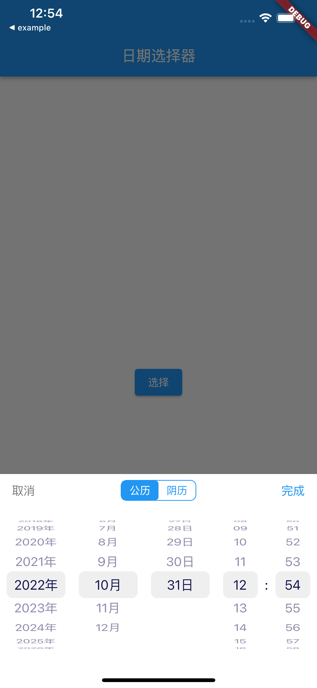
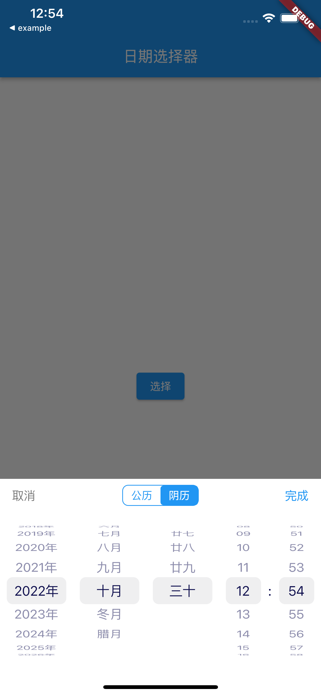

## Flutter 农历日期选择器

| 阳历显示          | 阴历显示          | 
| -------------------- | -------------------------------- |
|  |  |  |


## 引用
``` yaml
flutter_lunar_datetime_picker:
    git: https://github.com/LoquatZ/flutter_lunar_datetime_picker.git
lunar:
    git: https://github.com/6tail/lunar-flutter.git
```
## 注意
只对 [lunar_flutter](https://github.com/6tail/lunar-flutter) 进行了 dev_dependencies依赖，如果使用本包，需要单独依赖 


## 使用

``` dart
DatePicker.showDatePicker(
            context,
            lunarPicker: false,
            dateInitTime: DateInitTime(
                currentTime: DateTime.now(),
                maxTime: DateTime(2026, 12, 12),
                minTime: DateTime(2018, 3, 4)),
            onConfirm: (time) {
              debugPrint(time.toString());
            },
            onChanged: (time) {
              debugPrint("change:${time.toString()}");
            },
          );
```

## 感谢
- [flutter_datetime_picker](https://github.com/Realank/flutter_datetime_picker) 提供PickerView方案

- [lunar_flutter](https://github.com/6tail/lunar-flutter) 提供农历日期算法